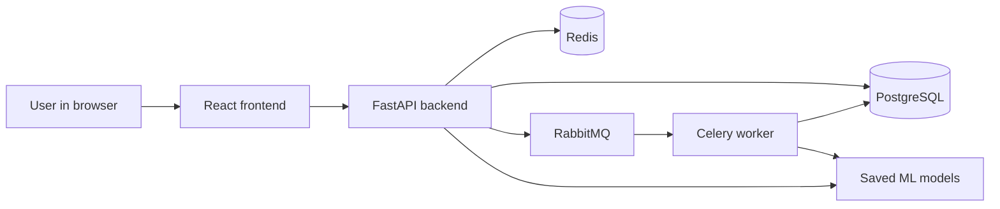
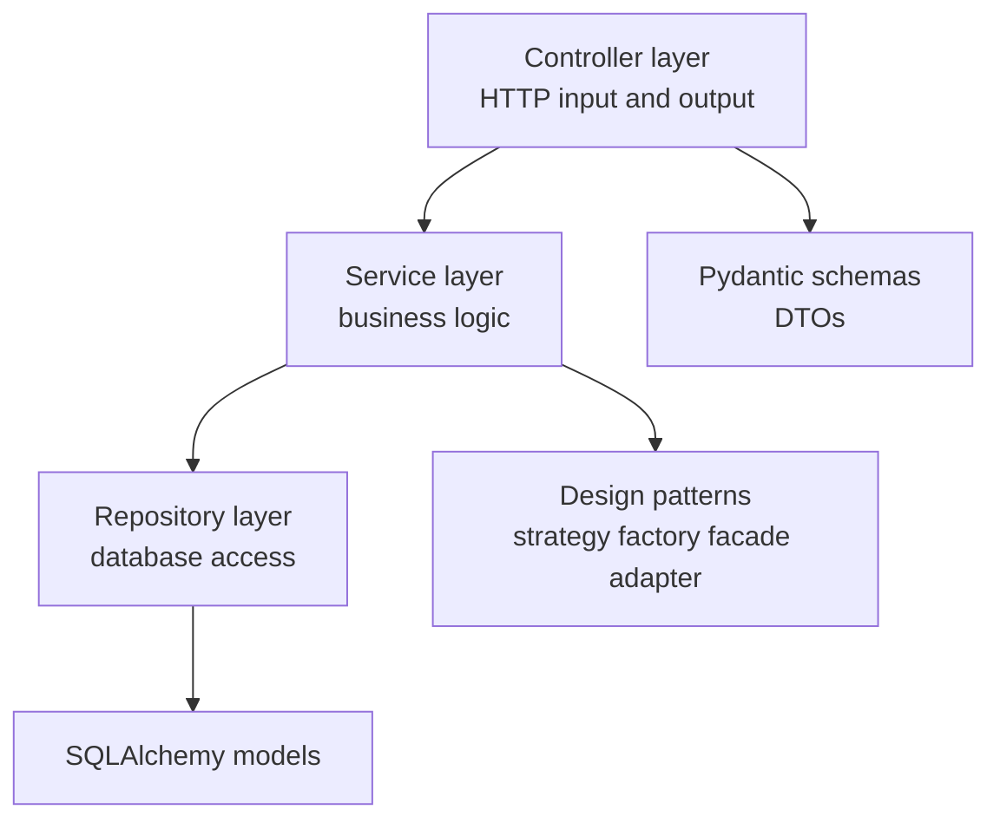
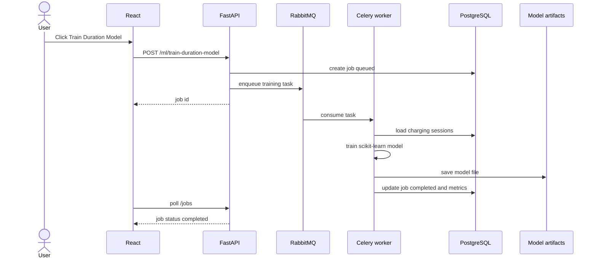

# EV Mobility Cloud Analytics

Full-stack demo app for EV charging analytics.

I built it as a compact but complete project for an e-mobility / cloud / data role. The idea is simple: generate EV charging sessions, store them, analyze them, train ML models in the background, then expose everything through an API and a small React dashboard.

It is not meant to be a huge enterprise product. It is meant to show that I can connect the important pieces: backend, database, async jobs, ML, rate limiting, logging, Docker and frontend.

---

## What the app does

- registers and logs in users with JWT
- generates realistic synthetic EV charging sessions
- stores the sessions in PostgreSQL
- shows analytics like total sessions, energy, duration and anomaly rate
- trains ML models asynchronously using RabbitMQ + Celery
- predicts charging duration using a trained regression model
- detects suspicious charging sessions with anomaly detection
- applies Redis rate limiting on sensitive endpoints
- logs requests, predictions and training jobs
- shows everything in a React dashboard

---

## Tech stack

### Backend

- FastAPI
- PostgreSQL
- SQLAlchemy
- Pydantic
- JWT authentication
- Redis
- RabbitMQ
- Celery
- pandas, numpy, scikit-learn, joblib
- pytest

### Frontend

- React
- TypeScript
- Vite
- Axios
- React Router
- Recharts
- Vitest + React Testing Library

### Infrastructure

- Docker
- Docker Compose
- separate services for API, frontend, database, Redis, RabbitMQ and worker

---

## Architecture



The app is split like a normal cloud service:

- React only handles UI
- FastAPI handles HTTP and exposes the API
- PostgreSQL stores users, sessions, jobs, metrics and prediction logs
- Redis handles rate limiting
- RabbitMQ is the message broker
- Celery runs long ML jobs outside the request cycle
- trained models are saved as artifacts and reused by the prediction endpoint

---

## Backend layering

I used an MVC-style structure adapted for FastAPI.



Main rule I tried to keep:

- controllers do not contain business logic
- services do the actual work
- repositories talk to the database
- models are only database models
- schemas are the API contract

---

## Async ML flow



This is the part I wanted to show clearly: training does not block the API request. The API just creates a job and the worker handles the heavy part.

---

## Design patterns used

| Pattern | Where | Why |
|---|---|---|
| Repository | `app/repositories/*` | keeps SQL/database logic away from services/controllers |
| Unit of Work | `app/patterns/unit_of_work.py` | groups DB operations into clear transactions |
| Strategy | `app/patterns/model_strategy.py` | separates duration prediction model from anomaly model |
| Factory | `app/patterns/data_generator_factory.py` | creates synthetic EV charging data in one place |
| Adapter | `app/patterns/broker_adapter.py` | hides Celery/RabbitMQ details behind a simple interface |
| Facade | `app/patterns/queue_manager.py` | gives the API one clean entry point for queue jobs |
| DTO / Schema | `app/schemas/*` | keeps request and response objects explicit |
| Service Layer | `app/services/*` | keeps business rules out of controllers |

---

## Main endpoints

### Auth

- `POST /auth/register`
- `POST /auth/login`
- `GET /auth/me`

### Data

- `POST /data/generate`
- `GET /data/sessions`
- `GET /data/sessions/{id}`
- `DELETE /data/sessions`

### Analytics

- `GET /analytics/summary`
- `GET /analytics/charger-performance`
- `GET /analytics/daily-energy`
- `GET /analytics/anomalies`

### Machine learning

- `POST /ml/train-duration-model`
- `POST /ml/train-anomaly-model`
- `GET /ml/metrics`
- `POST /ml/predict-duration`

### Jobs

- `GET /jobs`
- `GET /jobs/{job_id}`

Swagger docs:

```text
http://localhost:8000/docs
```

---

## How to run

```bash
docker compose up --build
```

Then open:

```text
Frontend: http://localhost:5173
Backend Swagger: http://localhost:8000/docs
RabbitMQ UI: http://localhost:15672
```

RabbitMQ default login:

```text
guest / guest
```

---

## Demo flow

1. Open the frontend.
2. Register a user.
3. Login.
4. Go to Sessions and generate 5000 sessions with seed 42.
5. Go to ML Training.
6. Start duration model training.
7. Start anomaly model training.
8. Go to Jobs and wait until the jobs are completed.
9. Go to Analytics and check the charts.
10. Go to Predict and test a charging duration prediction.

---

## Tests

Backend:

```bash
cd backend
pip install -r requirements-dev.txt
pytest -q
```

Frontend:

```bash
cd frontend
npm install
npm test
```

Tests cover business-level flows like:

- register and login
- protected routes
- generated sessions follow realistic constraints
- analytics match stored data
- prediction returns a positive duration
- prediction logs are created
- training endpoint creates queued jobs
- rate limiting blocks repeated login attempts
- frontend renders dashboard, sessions, jobs and prediction pages from mocked APIs

---

## What I would improve next

If I had more time, I would add:

- real EV charging dataset import
- Alembic migrations
- more advanced model evaluation
- user roles
- CI pipeline
- deployed demo
- better pagination controls in frontend
- downloadable CSV reports

---
